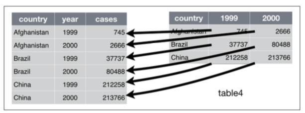
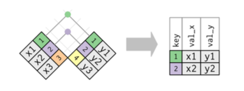
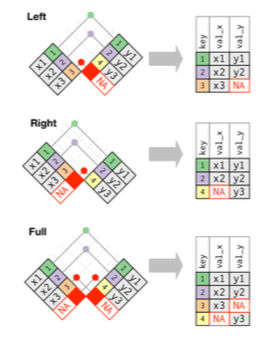

# Activar paquetes

```{r}
library(tidyverse)
library(lubridate)
library(haven)
library(readxl)
library(knitr)
```

# Limpiar espacio de trabajo

```{r}
rm(list = ls())

```

# Importar datos

Importen la base de datos: saber11_2019.csv

```{r}
saber11_2019 <- read_delim("Datos/saber11_2019.csv", delim = ";")
```

# Transformar bases de datos

¿Qué es tidy data i.e. datos limpios para análisis de datos?

Los datos limpios en este contexto cumplen 3 reglas:

1.  Cada variable debe tener su propia columna.
2.  Cada observación debe tener su propia fila.
3.  Cada valor debe tener su propia celda.

```{r, echo=FALSE, eval=TRUE, out.width = "100%", fig.align = 'center'}
include_graphics("tidy.png")
```

¿Cuál de las siguientes bases de datos son "tidy"? <https://r4ds.had.co.nz/tidy-data.html#tidy-data-1>

-   No todos los datos están estructurados de esta manera. Hay dos problemas comunes:

    1.  Una variable puede estar repartida en varias columnas.
    2.  Una observación puede estar repartida en varias filas.

## Reorganizar de ancho a largo

1.  Importen el conjunto de datos `gdp_growth_wide.csv`. Estos datos contienen la tasa de crecimiento del PIB para varios países entre 2009 y 2018.

```{r}
ipc <- read_excel("Datos/IPC_Indices.xlsx", range = "A9:R21")
```

2.  Usen la función `head()` para ver el contenido del conjunto de datos.

```{r}
head(ipc)
```

3.  ¿Es un conjunto de datos limpio?

Cuando el conjunto de datos tiene el problema 1, usamos la función `pivot_longer()` del paquete tidyr para limpiarlo:

```{r, echo=FALSE, eval=TRUE, out.width = "100%", fig.align = 'center'}

```

La función `pivot_longer` tiene cuatro argumentos:

1.  El conjunto de datos que se va a reformar o reorientar.
2.  *cols*: Las columnas que se van a reformar o reorientar.
3.  *names_to*: El nombre de la variable que se creará en la que van a quedar los valores que actualmente aparecen en los nombres de las columnas.
4.  *values_to*: El nombre de la variable que se creará en la que van a quedar los valores que actualmente aparecen en las celdas de la base de datos.

En el caso del conjunto gdp_growth_wide la función operaría de la siguiente manera:

```{r}
ipc_larga <- pivot_longer(ipc, 
                          cols = `2003`:`2019`, 
                          names_to = "ano", 
                          values_to = "ipc")
head(gdp_growth_long)
```

## Reorganizar de largo a ancho

1.  Importen el conjunto de datos `gdp.csv`. Estos datos contienen el pib per capita y la tasa de crecimiento para un grupo de países entre 2009 y 2018.

```{r}
gdp <- read_csv("Datos/gdp.csv")
head(gdp)
```

2.  Usen la función head para ver el contenido del conjunto de datos.

```{r}
head(gdp)
```

3.  ¿Es un conjunto de datos limpio?

4.  Cuando el conjunto de datos tiene el problema 2, usamos la función `pivot_wider()` del paquete tidyr para limpiarlo:

```{r, echo=FALSE, eval=TRUE, out.width = "100%", fig.align = 'center'}
include_graphics("spread.png")
```

La función `pivot_wider()` tiene 3 argumentos:

1.  El conjunto de datos.
2.  *names_from*: El nombre de la variable del conjunto actual en la que están los nombres de las variables.
3.  *values_from*: El nombre de la variable del conjunto actual en la que están los valores que corresponden a cada variable.

En el caso del conjunto deptos la función operaría de la siguiente manera:

```{r}
gdp_ancha <- pivot_wider(gdp, 
                   names_from =`Series Name`, 
                   values_from =  valores)
head(gdp_ancha)
```

## Separar cadenas de carácteres

-   Importen el archivo *lista.xlsx*.

```{r}
library(readxl)
lista <- read_excel("Datos/Lista.xlsx")
```

-   La función `separate` toma una cadena de caracteres (i.e. *string*) y la separa en dos o más columnas. Los argumentos de esta función son:

    -   El data.frame en el cual se quiere hacer la separación.

    -   El nombre de la variable que se quiere separar.

    -   El nombre de las variables que se van a crear dentro de un vector.

    -   El separador:

        -   Por defecto es el primer carácter que no es ni número ni letra.
        -   Si se pone un número este refiere a la posición en la que se debe hacer la separación. Los valores positivos empiezan en en el valor más a la izquierda de la cadena. Los valores negativos empiezan en -1 en el valor más a la derecha de la cadena.

-   Por ejemplo para separar los nombres en dos variables se emplearía la siguiente función:

```{r}
lista2 <- separate(data = lista, col = "Nombre(s)", into = c("Nombre1", "Nombre2"))
```

```{r}
lista3 <- separate(data = lista, 
                   col = "Nombre(s)", 
                   into = c("Nombre1", "Nombre2"), 
                   sep = " ")
```


-   Separen los apellidos en dos columnas distintas.

```{r}
lista3 <- separate(data = lista, 
                   col = "Apellidos", 
                   into = c("Apellido1", "Apellido2"), 
                   sep = " ", 
                   remove = FALSE)
```


-   Separen el correo electrónico en dos columnas distintas. La primera columna debe contener el nombre de usuario, y la segunda columna debe contener el resto de la dirección.

```{r}
lista4 <- separate(lista, col = `Correo Electrónico Institucional`, into = c("usuario", "resto"), sep = "@")
```

```{r}
lista5 <- separate(lista, col = `Correo Electrónico Institucional`, into = c("usuario", "resto"), sep = 10)
```

```{r}
lista6 <- separate(lista, col = `Correo Electrónico Institucional`, into = c("usuario", "resto"), sep = -22)
```

## Unir cadenas de carácteres

-   La función `unite` permite unir dos cadenas de carácteres en una sola variable. Los argumentos de esta función son:

    -   El data.frame en el cual se quiere hacer la separación.
    -   El nombre de la variable que se creará.
    -   El nombre de las variables que se van a unir.
    -   La manera como se van a separar los valores. Por defecto, el separador es: \_

-   Por ejemplo, en el archivo lista, para unir nombres y apellidos en una variable que se llame nombre_completo, se ejecutaría la siguiente función:

```{r}
lista7 <- unite(data = lista, col = "nombre_completo", "Nombre(s)", "Apellidos", sep = "*")
```

-   Vuelvan a unir el correo electrónico en una variable que se llame Correo.

```{r}
lista8 <- unite(lista4, col = "correo", "usuario", "resto", sep = "@")
```

# Manejo de datos faltantes

-   El paquete tidyr también contiene funciones para tratar los valores faltantes (i.e. NA).
-   Estas funciones principlamente permiten (1) eliminar las observaciones con valores faltantes (`drop_na`), (2) completar las observaciones con valores faltantes con los valores de observaciones previas o posteriores (`fill`), y (3) reemplazar los valores faltantes con otro valor (`replace_na`).
-   **Estas funciones deben usarse con cuidado**.
-   Antes de eliminar, completar o reemplazar valores faltantes es necesario conocer la estructura de los datos, entender porqué puede haber valores faltantes, y qué tipo de información se perdería si, por ejemplo, se descartan todas las observaciones que tienen datos faltantes.

## Explorar datos faltantes

Instalar y activar el paquete naniar:

```{r}
# install.packages("naniar")
library(naniar)
```

Acá encuentran un buen recurso para ver qué funcionalidades tiene el paquete: <https://cran.r-project.org/web/packages/naniar/vignettes/getting-started-w-naniar.html>

```{r}
library(help = "naniar")
```


Crear datos para explorar:

```{r}
puntajes <- saber11_2019 %>% 
  select(starts_with("PUNT"), ESTU_ETNIA, ESTU_INSE_INDIVIDUAL,
         starts_with("FAMI_EDUCACION"))
```

Explorar datos creados

```{r}
glimpse(puntajes)
```

```{r}
vis_miss(puntajes)
```

```{r}
gg_miss_var(puntajes)
```

## Borrar observaciones con datos faltantes:

La función `drop_na` elimina las observaciones con valores faltantes en las columnas que se indiquen. Si no se indica ninguna columna, entonces la función borra las observaciones con valores faltantes en todas las columnas:

-   Noten que actualmente la base saber11_2019 tiene 54621 observaciones.

-   Si aplico `drop_na` sin indicar ninguna columna se borran todas las observaciones pues es posible que todas las observaciones tengan algun valor faltante en alguna de las variables (P. Ej. ESTU_ETNIA)

```{r}
saber_sin_na <- drop_na(saber11_2019)
```

-   Para solamente borrar aquellas observaciones que tengan valores faltantes en las variables FAMI_ESTRATOVIVIENDA, FAMI_EDUCACIONMADRE y FAMI_EDUCACIONPADRE se debería usar la siguiente función:

```{r}
saber2 <- drop_na(saber11_2019, FAMI_ESTRATOVIVIENDA, FAMI_EDUCACIONMADRE, FAMI_EDUCACIONPADRE)
```

¿Cuántas observaciones se eliminan en este caso?

## Rellenar observaciones con datos faltantes:

La función `fill` rellena los valores faltantes con valores completos que estén antes o despúes de los faltantes.

-   Importen la base *PANEL_CARACTERISTICAS_GENERALES.dta*.
-   Fíjense que la variable nbi no tiene información para todos los años. En los años en los que no hay información actualmente hay datos faltantes.
-   Para sustituir esos valores faltantes por el último valor completo se usaría la función `fill` de la siguiente manera:

```{r}

general <- read_stata("Datos/PANEL_CARACTERISTICAS_GENERALES(2019).dta")
general <- fill(general, pobreza)
```

## Reemplazar observaciones faltantes

La función `replace_na` reemplaza los valores faltantes con los valores que se indiquen dentro de la función. Por ejemplo, para reemplazar los valores faltantes de la variable ESTU_ETNIA en la base de datos de saber11 2018, se usaría la siguiente función:

```{r}
saber11_2019 <- replace_na(data = saber11_2019, replace = list(ESTU_ETNIA = "Sin reporte"))
```

Dentro de la lista se pueden ingresar más variables.

# Unir bases de datos con distintas variables sobre algunos individuos 

Dos casos en los que es común unir bases de datos con distintas variables sobre los mismos individuos:

* En un mismo archivo, distintas bases de datos tienen variables para los mismos individuos. Por ejemplo, Encuesta Multipropósito de Bogotá o Panel Municipal CEDE.

* Una base de datos tienen información para individuos, y otra u otras tienen información para unidades de agrupación dentro de las que se encuentran esos individuos. Por ejemplo: estudiantes-colegios, colegios-municipios, individuos-hogares, individuos-firmas, etc.

En esos casos RStudio y el paquete dplyr proveen distintas funciones, según sea el caso y el objetivo de la unión.

Estas funciones cruzan las observaciones según una o varias variables que sirven de "llave" e identifica observaciones en las dos bases de datos, y luego copia las variables de una base a la otra. Hay varias opciones:

## Inner Join:

Solamente une las observaciones que se encuentran en las dos bases de datos:


## Outer Join:

- **Left Join:** Mantiene todas las observaciones de la primera base de datos.
- **Right Join:** Mantiene todas las observaciones de la segunda base de datos base de datos.
- **Full Join** Mantiene todas las observaciones de las dos bases de datos, así no hayan cruces.

```{r, out.height="70%", eval=TRUE, echo=FALSE, fig.align="center"}
library(knitr)

```

## Ejemplo 1

Voy a generar datos ficticios para crear dos bases. Primer fijo la semilla para que esto sea reproducible:

```{r}
set.seed(18032021)
```

Luego creo el número de identificación de los registros de la primera base y los organizo en orden ascendente:

```{r}
id <- sample(1:15, 10, replace = FALSE)
id <- sort(id)
```

Ahora genero una variable que se llama edad:

```{r}
edad <- sample(18:22, 10, replace = TRUE)
```

Por último, uno la identificación y la edad en un tibble:

```{r}
base1 <- tibble(id, edad)
base1
```

Ahora, creo el número de identificación de los registros de la segunda base y los organizo en orden ascendente:

```{r}
id <- sample(1:15, 10, replace = FALSE)
id <- sort(id)
```

Luego creo una variable que se llama genero:

```{r}
genero <- sample(c("femenino", "masculino"), 10, replace = TRUE)
```

Y uno las dos variables en un tibble:

```{r}
base2 <- tibble(id, genero)
base2
```
Podría usar las funciones `intersect`, `union` y `setdiff` para explorar las relaciones entre los identificaciones de las dos tablas que cree. 

`intersect` me muestra la intersección entre las dos columnas, es decir las identificaciones que son comunes a las dos tablas:

```{r}
intersect(base1$id, base2$id)
```
`union` me muestra la union de las dos columnas, es decir todas las identificaciones que están en las tablas:

```{r}
union(base1$id, base2$id)
```
`setdiff` me indica cuáles elementos aparecen en el primer conjunto pero no en el segundo:

```{r}
setdiff(base1$id, base2$id)
```
```{r}
setdiff(base2$id, base1$id)
```
Ahora, voy a ilustrar las distintas maneras de hacer la unión. `inner_join` une solamente las observaciones que encuentra en las dos bases:

```{r}
inner_join(base1, base2, by = "id")
```

`left_join` mantiene las observaciones de la base de la izquierda. La base de la izquierda es la primera que se incluye dentro de la función. Si no hay información para estas variables en la base de la derecha (la segunda que se incluye dentro de la función), dejan los valores como valores faltantes:

```{r}
left_join(base1, base2, by = "id")

```
`right_join` mantiene las observaciones de la base de la derecha. Si no hay información para estas variables en la base de la izquierda , dejan los valores como valores faltantes:

```{r}
right_join(base1, base2, by = "id")
```

`full_join` une todas las observaciones y si en alguna de las bases no hay información para alguno de los registros los deja como valores faltantes:

```{r}
full_join(base1, base2, by = "id")

base_resultante <- full_join(base1, base2, by = "id")

base_resultante <- base_resultante %>% arrange(edad, id)
base_resultante
```

## Ejemplo 2

Ahora voy a crear unos datos ficticios de colegios y estudiantes. Comienzo por la de colegios:

```{r}
cod_colegio <- c("A", "B", "C")
no_profesores <- sample(10:100, 3)
naturaleza <- sample(c("Público", "Privado"), 3, replace = TRUE)

info_colegios <- tibble(cod_colegio, no_profesores, naturaleza)
info_colegios
```

Ahora creo la información ficticia de estudiantes:

```{r}
id <- sample(1:15, 10, replace = FALSE)
id <- sort(id)
internet <- sample(c("Sí", "No"), 10, replace = TRUE)
educ_madre <- sample(c("No bachiller", "Bachiller", "Universitario"), 10, replace = TRUE)
colegio <- sample(c("A", "B", "C"), 10, replace = TRUE)
estudiantes <- tibble(id, internet, educ_madre, colegio)
estudiantes
```

¿Cuál sería la mejor manera de unir estas dos bases de datos?

```{r}
full_join(estudiantes, info_colegios, by = c("colegio"="cod_colegio"))
```

```{r}
left_join(estudiantes, info_colegios, by = c("colegio"="cod_colegio"))
```

```{r}
right_join(estudiantes, info_colegios, by = c("colegio"="cod_colegio"))
```


## Ejemplo 3

1. Cargue a R las bases de datos del panel municipal con los siguientes nombres, según corresponda:
    + general
    + gobierno
    
```{r}
gobierno <- read_stata("Datos/PANEL_BUEN_GOBIERNO(2019).dta")
```
  
2. Revise el contenido de una de las bases de datos. ¿Cuál(es) sería(n)  la(s) llave(s) para unir estas bases de datos?

```{r}
unique(gobierno$ano)
table(gobierno$ano)
glimpse(general)
```

```{r}
glimpse(gobierno)
```

```{r}
intersect(names(general), names(gobierno))
```
3. Use inner_join para unir la base general y gobierno. LLame a esta nueva base de datos panel_municipal:

```{r}
panel_municipal <- inner_join(general, gobierno, by = c("codmpio", "ano"))
```

```{r}
panel_municipal <- left_join(general, gobierno, by = c("codmpio", "ano"))
```

```{r}
panel_municipal <- full_join(general, gobierno, by = c("codmpio", "ano"))
```

```{r}
panel_municipal <- right_join(general, gobierno, by = c("codmpio", "ano"))
```


4. A la base anterior, una el panel de salud:

```{r}

```

## ¿Qué salió mal cuando intentamos unir los dos paneles usando solamente el código del municipio?

En seguida voy a recrear el ejemplo a pequeña escala para ver lo que salió mal:

Primero, creo las dos bases:

```{r}
codmpio <- rep(c(11001, 5001, 76001), 3)
municipio <-  rep(c("Bogotá", "Medellín", "Cali"), 3)
ano <- rep(c(2018, 2019, 2020), each = 3)
depto <- rep(c("Cundinamarca", "Antioquia", "Valle del Cauca"), 3)
puntaje <- sample(1:20, 9)

base1 <- tibble(codmpio, municipio, ano, depto)
base1
```

```{r}
base2 <- tibble(codmpio, ano, puntaje)
base2
```

Ahora, voy a unir las dos bases usando `inner_join` y solamente el código de municipio:

```{r}
resultado1 <- inner_join(base1, base2, by = "codmpio")
resultado1
```

Entonces, ¿Qué salió mal cuando intentamos unir los dos paneles usando solamente el código del municipio?

# Manejo de variables y observaciones 

El paquete *dplyr* provee varias funciones para la manipulación de datos:

Función      | Propósito
------------ | ----------
`select()`   | Selecciona variables
`rename()`   | Renombra variables
`filter()`   | Filtra observaciones
`mutate()`   | Crea variables
`summarize()`| Resume variables (P. Ej. Estadísticas descriptivas)
`group_by()` | Crea grupos de observaciones, para luego usar `mutate()` o `summarize()`
`arrange()`  | Ordena observaciones.

La estructura de todas estas funciones es similar:

- El primer argumento es la base de datos que se quiere modificar.

- Los argumentos siguientes reflejan lo que se quiere hacer con la base de datos.

- El resultado es una base de datos modificada.

## Filtrar observaciones: `filter()`

- `filter()` sirve para crear un subconjunto de observaciones con base en sus valores.
- El primer argumento es la base que se quiere filtrar.
- Los argumentos siguientes son las expresiones que filtran las observaciones.
- **El primer argumento no es necesario si se usa el operador *pipe*: `%>%`**
- Para filtrar los estudiantes que asisten a colegios públicos se usaría la siguiente función:

```{r}
oficial <- filter(saber11_2019,
                  COLE_NATURALEZA == "OFICIAL")
table(oficial$COLE_NATURALEZA)
```

- Ó:

```{r}
oficial2 <- saber11_2019 %>%
  filter(COLE_NATURALEZA == "OFICIAL") 
```

El atajo para el *pipe* es **Shift + Control + M**

```{r}
oficial2 <- saber11_2019 %>%
  filter(COLE_NATURALEZA == "OFICIAL") %>% 
  mutate(PERCENTIL_INGLES = as.character(PERCENTIL_INGLES))
```


- Filtrar por más de una condición:

```{r}
estrato_colegio <- saber11_2019 %>% filter(FAMI_ESTRATOVIVIENDA == "Estrato 1", COLE_NATURALEZA == "OFICIAL")
table(estrato_colegio$FAMI_ESTRATOVIVIENDA, estrato_colegio$COLE_NATURALEZA)
```

¿Cómo podría hacer si quiero más de un estrato?: 

```{r}
estrato_colegio <- saber11_2019 %>% filter(FAMI_ESTRATOVIVIENDA == "Estrato 1" | FAMI_ESTRATOVIVIENDA == "Estrato 2", COLE_NATURALEZA == "OFICIAL")

estrato_colegio2 <- saber11_2019 %>% filter(FAMI_ESTRATOVIVIENDA %in% c("Estrato 1",  "Estrato 2", "Estrato 3"), COLE_NATURALEZA == "OFICIAL")


table(estrato_colegio$FAMI_ESTRATOVIVIENDA, estrato_colegio$COLE_NATURALEZA)
```

- Filtrar variables cuantitativas entre dos valores

```{r}
summary(saber11_2019$PUNT_GLOBAL)
```

Filtren las observaciones que estén entre el primer y el tercer cuartil:

```{r}
saber_ric <- saber11_2019 %>% filter(PUNT_GLOBAL >= 207, PUNT_GLOBAL <= 282)

saber_ric2 <- saber11_2019 %>% filter(between(PUNT_GLOBAL, 207, 282))
```

## Seleccionar, borrar, renombrar y reorganizar variables: `select()`

- `select()` sirve para crear un una base de datos con un subconjunto de variables.
- El primer argumento es la base que contiene todas las variables.
- Los argumentos siguientes dan instrucciones para seleccionar las bases de datos.

### Maneras de seleccionar las variables:

- Nombrándolas una por una
- Poniéndolas en un vector
- Con una secuencia si son consecutivas.
- Usando las siguientes funciones:
    - `starts_with()`
    - `ends_with()`
    - `contains()`
    - `num_range()`
    
```{r}
identificacion <- saber11_2019 %>% 
  select(ESTU_TIPODOCUMENTO, ESTU_NACIONALIDAD, ESTU_GENERO)
```

```{r}
variables <- c("ESTU_TIPODOCUMENTO", "ESTU_NACIONALIDAD", "ESTU_GENERO")
identificacion2 <- saber11_2019 %>% 
  select(all_of(variables))
```

```{r}
variables2 <- c("ESTU_TIPODOCUMENTO", "ESTU_NACIONALIDAD", "ESTU_GENERO", "P6020")
identificacion3 <- saber11_2019 %>% 
  select(any_of(variables2))
```

```{r}
básicos <- saber11_2019 %>% 
  select(ESTU_TIPODOCUMENTO:ESTU_COD_RESIDE_DEPTO)
```
    
```{r}
puntajes <- saber11_2019 %>% 
  select(starts_with("PUNT"))
```

```{r}
ingles <- saber11_2019 %>% 
  select(ends_with("INGLES"))
```

```{r}
nse <- saber11_2019 %>% 
  select(contains("NSE_"))
```

```{r}
saber11_2019 <- saber11_2019 %>% 
  select(-contains("NSE_"))

saber11_2019 <- saber11_2019 %>% select(-ESTU_TIENEETNIA)
```

`everything()`sirve para reorganizar variables, aunque `relocate`, en la versión más reciente de dplyr, cumple esa función de mejor manera:

```{r}
saber11_2019 <- saber11_2019 %>% 
  select(starts_with("PUNT"), everything())

saber11_2019 <- saber11_2019 %>% 
  relocate(starts_with("PUNT"))

saber11_2019 <- saber11_2019 %>% relocate(starts_with("FAMI"))

saber11_2019 <- saber11_2019 %>% 
  relocate(contains("LABOR"), .after = PUNT_INGLES)

saber11_2019 <- saber11_2019 %>% relocate(starts_with("FAMI"), starts_with("PUNT"), COLE_BILINGUE)
```

`rename()` permite cambiar el nombre de variables, dejando el resto de variables intacto.

```{r}
saber11_2019 <- saber11_2019 %>% 
  rename(tipo_colegio = COLE_CARACTER)
```

*num_range()* permite seleccionar variables que contienen números en su nombre, indicando un rango numérico.

- Carguen la base de datos *Area_Caracteristicas_generales_Personas.csv*.
- Con base en esta base de datos, creen una base de datos que se llame variables y contenga las variables quE están entre P6010 y P6100.

```{r}
personas <- read_delim("Datos/Area - CaracterIsticas generales (Personas).csv", delim = "|")
```


```{r}
variables <- personas %>% 
  select(num_range("P", 6010:6100))
```

## Crear o transformar variables: `mutate()`

- `mutate()` sirve para crear o transformar variables existentes.
- Las variables siempre son agregadas al final del conjunto actual.
- En la creación de variables se puede usar:
    - Operaciones aritméticas.
    - Logarítmos.
    - lags y leads.
    - Comparaciones lógicas.
    - Rankings, entre otros.
- También se pueden reconvertir variables, por ejemplo a fecha o a factor, y se pueden crear constantes.
    
```{r}
saber11_2019 <- saber11_2019 %>% 
  mutate(periodo = "2019", 
         mate_lect = PUNT_MATEMATICAS + PUNT_LECTURA_CRITICA, 
         ln_punt_global = log(PUNT_GLOBAL), 
         ESTU_INSE_INDIVIDUAL = ESTU_INSE_INDIVIDUAL/100, 
         genero = factor(ESTU_GENERO), 
         fecha_nac = dmy(ESTU_FECHANACIMIENTO)
         )

saber11_2019 <- saber11_2019 %>% 
  arrange(desc(PUNT_GLOBAL)) %>% 
  mutate(ranking = row_number())


```
    

### Lags y leads en `mutate()`

- Carguen la base de datos de la trm y asegúrense que R entienda las fechas de manera correcta.
- Usen `arrange` para organizar las fechas de la más reciente a la más antigua.
- Creen tres variables en esta base de datos:
  - Un rezago (t-1) de la variable VALOR.
  - Dos rezagos (t-2) de la variable VALOR.
  - El valor del periodo siguiente (t+1) de la misma variable

```{r}
trm <- read_csv("https://www.datos.gov.co/api/views/mcec-87by/rows.csv?accessType=DOWNLOAD")
```

```{r}
trm <- trm %>% 
  mutate(fecha_hasta = dmy(VIGENCIAHASTA)) %>% 
  arrange(fecha_hasta)

trm <- trm %>% mutate(trm_lag1 = lag(VALOR), 
                      trm_lag2 = lag(VALOR, n = 2), 
                      trm_lag3 = lag(VALOR, n = 3), 
                      trm_lead1 = lead(VALOR))

```


### Funciones `if_else`, `recode` y `case_when` en `mutate()`

- `recode` se usa cuando los cambios que se planean hacer son *uno a uno*, dentro de las categorías de la variable.

- Estas tres funciones son útiles para crear variables dummy o binarias, para crear variables categóricas con base en variables cuantitativas, o para modificar variables categóricas.

- `if_else` incluye una condición, y asigna un valor a la variable que se crea o modifica si la condición se cumple, y otro valor si no se cumple.

    - Es necesario usar esta función con cuidado **particularmente con variables que tengan datos faltantes**, porque el resultado puede ser que se sustiya con un valor lo que debería ser un valor faltante.

- `case_when` se usa cuando los criterios para la creación o modificación de las categorías de la variable que se crea o modifica son más complejos. Por ejemplo, cuando se quiere crear una variable categórica con base en los valores de una variable cuantitativa o en varias categorías de una variable categórica.

- Use la función `recode` para crear una variable que se llame **privado** que sea igual a 1 para los estudiantes que estudian en colegios privados y 0 para los estudiantes que estudian en colegios públicos Use la variable `COLE_NATURALEZA`.

```{r}
table(saber11_2019$COLE_NATURALEZA)

saber11_2019 <- saber11_2019 %>% 
  mutate(privado = recode(COLE_NATURALEZA, "OFICIAL" = 0, "NO OFICIAL" = 1))

table(saber11_2019$COLE_NATURALEZA, saber11_2019$privado)
```

- Use la función `if_else` para crear una variable que se llame **bogota** que sea igual a 1 para los estudiantes que residen en Bogotá y 0 para quienes residen en cualquier otro municipio. Use la variable `ESTU_MCPIO_RESIDE`.

```{r}
n_distinct(saber11_2019$ESTU_MCPIO_RESIDE)

saber11_2019 <- saber11_2019 %>% 
  mutate(bogota = if_else(ESTU_MCPIO_RESIDE == "BOGOTÁ D.C.", 1, 0))
```

- Use la función `case_when` para crear una variable que se llame **estrato** que tenga tres categorías: *bajo* para los estudiantes de estratos 1 y 2, *medio* para los estudiantes de estratos 3 y 4, y *alto* para los estudiantes de estratos 5 y 6. Use la variable `FAMI_ESTRATOVIVIENDA`.

```{r}
table(saber11_2019$FAMI_ESTRATOVIVIENDA)
unique(saber11_2019$FAMI_ESTRATOVIVIENDA)

saber11_2019 <- saber11_2019 %>% 
  mutate(estrato = case_when(
    FAMI_ESTRATOVIVIENDA %in% c("Estrato 1", "Estrato 2") ~ "Bajo", 
    FAMI_ESTRATOVIVIENDA %in% c("Estrato 3", "Estrato 4") ~ "Medio",
    FAMI_ESTRATOVIVIENDA %in% c("Estrato 5", "Estrato 6") ~ "Alto", 
    FAMI_ESTRATOVIVIENDA == "Sin Estrato" ~ "Sin Estrato"
  ))

table(saber11_2019$FAMI_ESTRATOVIVIENDA, saber11_2019$estrato, useNA = c("ifany"))
```


## Hacer resumenes de obervaciones: `summarize()`

- `summarize()` colapsa una base de datos en una sola fila que contiene medidas de resumen de la base de datos.

- Las medidas de resumen pueden incluir:

  - Medidas de tendencia central.
  - Medidas de dispersión.
  - Medidas de posición.
  - Frecuencias.
  - Frecuencias y proporciones para valores lógicos, entre otros.

```{r}
resumen <- saber11_2019 %>% summarize(Media = mean(PUNT_GLOBAL))
```

```{r}
resumen <- saber11_2019 %>% summarize(Media = mean(PUNT_GLOBAL), 
                                      Desviación = sd(PUNT_GLOBAL))
```

```{r}
resumen <- saber11_2019 %>% summarize(Media_PG = mean(PUNT_GLOBAL), 
                                      Desviación_PG = sd(PUNT_GLOBAL), 
                                      Media_PM = mean(PUNT_MATEMATICAS), 
                                      Desviación_PM = sd(PUNT_MATEMATICAS))
```


- Cuando se usa con `group_by()` crea medidas de resumen para los grupos incluidos en `group_by()`.

```{r}
resumen_genero <- saber11_2019 %>% 
  group_by(ESTU_GENERO) %>% 
  summarize(Media_PG = mean(PUNT_GLOBAL))
```

```{r}
resumen_estrato <- saber11_2019 %>% 
  group_by(FAMI_ESTRATOVIVIENDA) %>% 
  summarize(Media_PG = mean(PUNT_GLOBAL), 
            Desviación_PG = sd(PUNT_GLOBAL))
```

```{r}
resumen_departamento <- saber11_2019 %>% 
  group_by(COLE_DEPTO_UBICACION) %>% 
  summarize(Media_PG = mean(PUNT_GLOBAL), 
            Desviación_PG = sd(PUNT_GLOBAL)) %>% 
  arrange(desc(Media_PG))
```

```{r}
resumen_privado_rural <- saber11_2019 %>% 
  group_by(COLE_NATURALEZA, COLE_AREA_UBICACION) %>% 
  summarize(Media_PG = mean(PUNT_GLOBAL), 
            Desviación_PG = sd(PUNT_GLOBAL))
```

```{r}
resumen_completo_natu <- saber11_2019 %>% 
  group_by(COLE_NATURALEZA) %>% 
  summarize(summary(PUNT_GLOBAL))
```


Cuando se usa con `rowwise()` crea medidas por fila para las  para las variables incluidas en `rowwise()`.

```{r}
suma_puntajes <- saber11_2019 %>% 
  rowwise() %>% 
  summarize(suma = sum(c(PUNT_LECTURA_CRITICA, PUNT_MATEMATICAS)))
```

- `group_by()` y `rowwise()` también se pueden usar para crear variables con `mutate()`. Usen `group_by()` para crear una variable que contenga el promedio del puntaje global para el municipio en el que se encuentra ubicado el colegio del estudiante:

```{r}
saber11_2019 <- saber11_2019 %>% 
  group_by(COLE_MCPIO_UBICACION) %>% 
  mutate(media_mcpio = mean(PUNT_GLOBAL, na.rm = TRUE)) %>% 
  relocate(COLE_MCPIO_UBICACION, media_mcpio) %>% 
  arrange(COLE_MCPIO_UBICACION)
```

Usen `rowwise()` y `mutate` para crear una variable que contenga el promedio de los puntajes:

```{r}
saber11_2019 <- saber11_2019 %>% 
  rowwise() %>% 
  mutate(media_punt = mean(c(PUNT_MATEMATICAS, PUNT_LECTURA_CRITICA, 
                             PUNT_C_NATURALES, PUNT_SOCIALES_CIUDADANAS,
                             PUNT_INGLES))) %>% 
  relocate(media_punt, starts_with("PUNT")) %>% 
  ungroup()
```

- `across` permite usar `summarize()` para un conjunto de variables. Por ejemplo, usemos `across` para calcular el promedio de cada uno de los puntajes. 

```{r}
promedios <- saber11_2019 %>% 
  summarize(across(.cols = starts_with("PUNT"), .fns = mean))
```

Revisen la ayuda de la función `across` para ver cómo podrían incluir argumentos adicionales para la función `mean`. Vuelvan a ejecutar la función anterior incluyendo el argumento `na.rm = TRUE`. 

```{r}
promedios <- saber11_2019 %>% 
  summarize(across(.cols = starts_with("PUNT"), .fns = mean, na.rm = TRUE))
```

```{r}
promedios <- saber11_2019 %>% 
  summarize(across(.cols = starts_with("PUNT"), .fns = ~ mean(.x, na.rm = TRUE)))
```

```{r}
prom_num <- saber11_2019 %>% 
  summarise(across(.cols = where(is.numeric), .fns = mean, na.rm = TRUE))
```

¿Cómo se podría ejecutar más de una función? Modifique la función anterior para calcular el promedio y la desviación estándar de cada puntaje.

```{r}
promedios <- saber11_2019 %>% 
  summarize(across(.cols = starts_with("PUNT"), 
                   .fns = list(media = mean, desviacion = sd), na.rm = TRUE))
```


Realice el procedimiento anterior para cada departamento:

```{r}
promedios <- saber11_2019 %>% 
  group_by(COLE_DEPTO_UBICACION) %>% 
  summarize(across(.cols = starts_with("PUNT"), 
                   .fns = list(media = mean, desviacion = sd),
                   na.rm = TRUE))
```

### Función `count()`

`count()` es una buena opción para calcular frecuencias absolutas.

Por ejemplo, para contar cuántos estudiantes hay en cada departamento podría usar la siguiente función:

```{r}

```

Creen una base que contenga el número de estudiantes para cada estrato y cada nivel educativo de la mamá (en la misma base).

https://dplyr.tidyverse.org/reference/index.html

¿Cómo se haría todo esto en base R?:
```{r}
library(help = "dplyr")
vignette("base")
```

