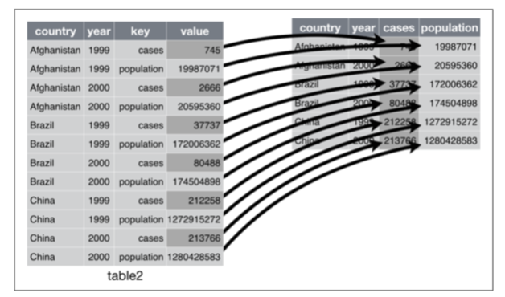

# Activar paquetes

```{r}
library(tidyverse)
library(haven)
```

# Limpiar espacio de trabajo

```{r}
rm(list = ls())
```

# Transformar bases de datos

¿Qué es tidy data i.e. datos limpios para análisis de datos?

Los datos limpios en este contexto cumplen 3 reglas:

1. Cada variable debe tener su propia columna. 
2. Cada observación debe tener su propia fila. 
3. Cada valor debe tener su propia celda.

```{r, echo=FALSE, eval=TRUE, out.width = "100%", fig.align = 'center'}
include_graphics("tidy.png")
```

¿Cuál de las siguientes bases de datos son "tidy"?
https://r4ds.had.co.nz/tidy-data.html#tidy-data-1

- No todos los datos están estructurados de esta manera. Hay dos problemas comunes:
    1. Una variable puede estar repartida en varias columnas. 
    2. Una observación puede estar repartida en varias filas. 
   
## Reorganizar de ancho a largo

1. Importen el conjunto de datos `gdp_growth_wide.csv`. Estos datos contienen la tasa de crecimiento del PIB para varios países entre 2009 y 2018. 

```{r}
gdp_growth_wide <- read_excel("Datos/gdp_growth_wide.xlsx")
```

2. Usen la función `head()` para ver el contenido del conjunto de datos.

```{r}

```

3. ¿Es un conjunto de datos limpio?

Cuando el conjunto de datos tiene el problema 1, usamos la función `pivot_longer()` del paquete tidyr para limpiarlo:

```{r, echo=FALSE, eval=TRUE, out.width = "100%", fig.align = 'center'}

```

La función `pivot_longer` tiene cuatro argumentos:
      
1. El conjunto de datos que se va a reformar o reorientar.
2. *cols*: Las columnas que se van a reformar o reorientar.
3. *names_to*: El nombre de la variable que se creará en la que van a quedar los valores que actualmente aparecen en los nombres de las columnas.
4. *values_to*: El nombre de la variable que se creará en la que van a quedar los valores que actualmente aparecen en las celdas de la base de datos.

En el caso del conjunto gdp_growth_wide la función operaría de la siguiente manera:

```{r}
gdp_growth_long <- pivot_longer(gdp_growth_wide, 
                          YR2009:YR2018, 
                          names_to = "YEAR", 
                          values_to = "GROWTH")
head(gdp_growth_long)
```

## Reorganizar de largo a ancho

1. Importen el conjunto de datos `gdp.csv`. Estos datos contienen el pib per capita y la tasa de crecimiento para un grupo de países entre 2009 y 2018.

```{r}
gdp <- read_csv("Datos/gdp.csv")
head(gdp)
```

2. Usen la función head para ver el contenido del conjunto de datos. 

```{r}

```

3. ¿Es un conjunto de datos limpio?

4. Cuando el conjunto de datos tiene el problema 2, usamos la función `pivot_wider()` del paquete tidyr para limpiarlo:

```{r, echo=FALSE, eval=TRUE, out.width = "100%", fig.align = 'center'}

```

La función `pivot_wider()` tiene 3 argumentos:
      
1. El conjunto de datos.
2. *names_from*: El nombre de la variable del conjunto actual en la que están los nombres de las variables.
3. *values_from*: El nombre de la variable del conjunto actual en la que están los valores que corresponden a cada variable.

En el caso del conjunto deptos la función operaría de la siguiente manera:

```{r}
gdp_long <- pivot_wider(gdp, 
                   names_from =`Series Name`, 
                   values_from =  valores)
head(gdp_long)
```

## Separar cadenas de carácteres

```{r}
gdp_growth_long <- separate(gdp_growth_long, YEAR, into = c("YR", "year"), sep = -4)
```


- Importen el archivo *lista.xlsx*. 

```{r}
library(readxl)
lista <- read_excel("Datos/Lista.xlsx")
```

- La función `separate` toma una cadena de caracteres (i.e. *string*) y la separa en dos o más columnas. Los argumentos de esta función son:
  - El data.frame en el cual se quiere hacer la separación. 
  - El nombre de la variable que se quiere separar. 
  - El nombre de las variables que se van a crear dentro de un vector.
  - El separador:
      - Por defecto es el primer carácter que no es ni número ni letra. 
      - Si se pone un número este refiere a la posición en la que se debe hacer la separación. Los valores positivos empiezan en en el valor más a la izquierda de la cadena. Los valores negativos empiezan en -1 en el valor más a la derecha de la cadena.
- Por ejemplo para separar los nombres en dos variables se emplearía la siguiente función:

```{r}
lista2 <- separate(data = lista, col = Nombres, into = c("Nombre1", "Nombre2"))
```

- Separen los apellidos en dos columnas distintas.

- Separen el correo electrónico en dos columnas distintas. La primera columna debe contener el nombre de usuario, y la segunda columna debe contener el resto de la dirección.

```{r}
lista2 <- separate(lista2, col = `Correo Electrónico`, into = c("usuario", "resto"), sep = "@")
```

```{r}
lista3 <- separate(lista, col = `Correo Electrónico`, into = c("usuario", "resto"), sep = 10)
```

```{r}
lista4 <- separate(lista, col = `Correo Electrónico`, into = c("usuario", "resto"), sep = -10)
```

## Unir cadenas de carácteres

- La función `unite` permite unir dos cadenas de carácteres en una sola variable. Los argumentos de esta función son:
  - El data.frame en el cual se quiere hacer la separación. 
  - El nombre de la variable que se creará. 
  - El nombre de las variables que se van a unir. 
  - La manera como se van a separar los valores. Por defecto, el separador es: _

- Por ejemplo, en el archivo lista, para unir nombres y apellidos en una variable que se llame nombre_completo, se ejecutaría la siguiente función: 


```{r}
lista3 <- unite(data = lista, col = nombre_completo, Nombres, Apellidos, sep = " ")
```

- Vuelvan a unir el correo electrónico en una variable que se llame Correo. 

```{r}

```


# Manejo de datos faltantes

- El paquete tidyr también contiene funciones para tratar los valores faltantes (i.e. NA). 
- Estas funciones principlamente permiten (1) eliminar las observaciones con valores faltantes (`drop_na`), (2) completar las observaciones con valores faltantes con los valores de observaciones previas o posteriores (`fill`), y (3) reemplazar los valores faltantes con otro valor (`replace_na`).
- **Estas funciones deben usarse con cuidado**. 
- Antes de eliminar, completar o reemplazar valores faltantes es necesario conocer la estructura de los datos, entender porqué puede haber valores faltantes, y qué tipo de información se perdería si, por ejemplo, se descartan todas las observaciones que tienen datos faltantes. 

## Explorar datos faltantes

Instalar y activar el paquete naniar:

```{r}
# install.packages("naniar")
library(naniar)
```
Acá encuentran un buen recurso para ver qué funcionalidades tiene el paquete: https://cran.r-project.org/web/packages/naniar/vignettes/getting-started-w-naniar.html

Crear datos para explorar:

```{r}
puntajes <- saber11_2019 %>% 
  select(starts_with("PUNT"), ESTU_ETNIA, ESTU_INSE_INDIVIDUAL,
         starts_with("FAMI_EDUCACION"))
```

Explorar datos creados

```{r}
glimpse(puntajes)
```


```{r}
vis_miss(puntajes)
```

```{r}
gg_miss_var(puntajes)
```


## Borrar observaciones con datos faltantes:

La función `drop_na` elimina las observaciones con valores faltantes en las columnas que se indiquen. Si no se indica ninguna columna, entonces la función borra las observaciones con valores faltantes en todas las columnas:

- Importen la base de datos: saber11_2019.csv

```{r}
saber11_2019 <- read_delim("Datos/saber11_2019.csv", delim = ";")
```

- Noten que actualmente la base tiene 54621 observaciones. 

- Si aplico `drop_na` sin indicar ninguna columna se borran todas las observaciones pues es posible que todas las observaciones tengan algun valor faltante en alguna de las variables (P. Ej. ESTU_ETNIA)

```{r}
saber_sin_na <- drop_na(saber11_2019)
```

- Para solamente borrar aquellas observaciones que tengan valores faltantes en las variables FAMI_ESTRATOVIVIENDA, FAMI_EDUCACIONMADRE y FAMI_EDUCACIONPADRE se debería usar la siguiente función:

```{r}
saber2 <- drop_na(saber11_2019, FAMI_ESTRATOVIVIENDA, FAMI_EDUCACIONMADRE, FAMI_EDUCACIONPADRE)
```

¿Cuántas observaciones se eliminan en este caso?

## Rellenar observaciones con datos faltantes: 

La función `fill` rellena los valores faltantes con valores completos que estén antes o despúes de los faltantes.

- Importen la base *PANEL_CARACTERISTICAS_GENERALES.dta*.
- Fíjense que la variable nbi no tiene información para todos los años. En los años en los que no hay información actualmente hay datos faltantes.
- Para sustituir esos valores faltantes por el último valor completo se usaría la función `fill` de la siguiente manera:

```{r}

general <- read_stata("Datos/PANEL_CARACTERISTICAS_GENERALES(2019).dta")
general <- fill(general, pobreza)
```

## Reemplazar observaciones faltantes

La función `replace_na` reemplaza los valores faltantes con los valores que se indiquen dentro de la función. Por ejemplo, para reemplazar los valores faltantes de la variable ESTU_ETNIA en la base de datos de saber11 2018, se usaría la siguiente función:

```{r}
saber11_2019 <- replace_na(data = saber11_2019, replace = list(ESTU_ETNIA = "Sin reporte"))
```

Dentro de la lista se pueden ingresar más variables.
